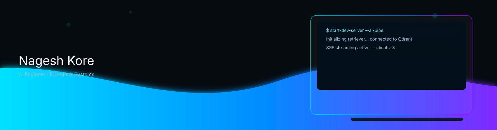
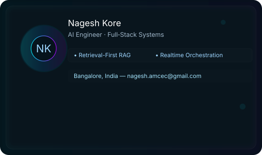
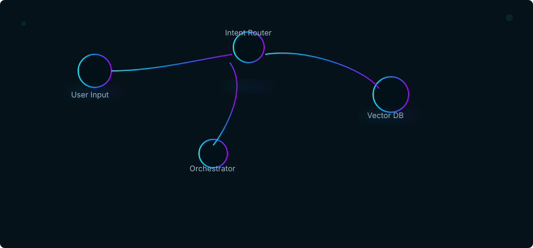
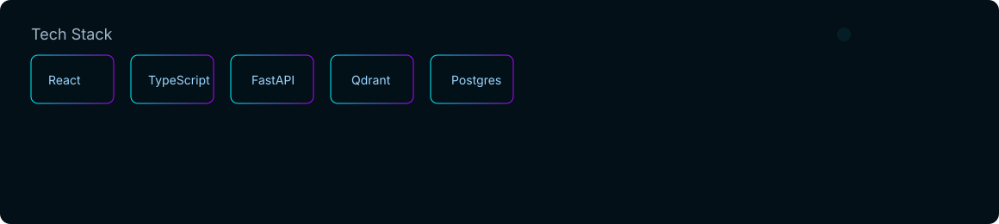

<div align="center">



<br/>

[](https://www.linkedin.com/in/nagesh-kore-7566b6254)
[](https://github.com/Nagukore)
[](https://nageshs.vercel.app/)
[](mailto:nagesh.amcec@gmail.com)
[](https://www.instagram.com/the.nagesh)


</div>

<br/>

<div align="center">

</div>

---

## About Me

I build AI-integrated systems that have to survive contact with real users and real data — not demos.

```yaml
name:        Nagesh Kore
location:    Bangalore, India
role:        Full-Stack Engineer & AI Systems Builder
education:   B.E. in AI & ML — AMC Engineering College
experience:  Developer Intern @ ThoughtsCrest (Core Banking Domain)

focus:
  - AI-integrated full-stack systems
  - Agentic orchestration & intent routing
  - Retrieval-Augmented Generation (RAG)
  - Realtime infrastructure & synchronization
  - Automation pipelines & developer tooling
  - Production deployment & scalable architecture

engineering_principles:
  - Build for production, not just demos
  - API-first architecture
  - Systems should scale cleanly
  - Automation should solve real operational problems
  - If it's not deployed, it's not done
```

**Problem space I keep returning to:**

- **Fragmented workflows** → orchestration systems that route intent (KNOWLEDGE / ACTION / GENERAL) instead of hardcoding every path
- **Stale or unstructured knowledge** → RAG pipelines that make enterprise and document data queryable in plain language
- **Manual, repetitive coordination** → automation that extracts structure from unstructured input (meetings → tasks → dependency graphs)
- **The gap between prototype and production** → I ship end-to-end: auth, RBAC, realtime sync, hosting — not just the model call

---

## Current Focus

| | | |
|---|---|---|
| 🧩 Agentic AI & Multi-Agent Orchestration | 🔎 Retrieval-Augmented Generation | 🧠 Memory Architectures for AI Assistants |
| 📡 Realtime Streaming Systems | 🗂️ Vector Databases & Semantic Search | ⚙️ AI-Powered Workflow Automation |
| 🖥️ Local LLM Deployment Pipelines | 🏗️ Production-Grade System Design | 🔁 Developer Productivity Tooling |

---

## Core Expertise

<details>
<summary><b>Frontend Engineering</b></summary>
<br/>

- React ecosystem & multi-page application architecture
- TypeScript — type-safe, scalable codebases
- Responsive UI systems & TailwindCSS
- Progressive Web Applications (offline-capable)
- State management & component architecture
- E-commerce UI and workflow design

</details>

<details>
<summary><b>Backend & APIs</b></summary>
<br/>

- FastAPI microservice architecture
- Node.js backend systems
- REST API design & JWT authentication
- Role-Based Access Control (RBAC)
- Realtime infrastructure & event-driven workflows

</details>

<details>
<summary><b>Databases & Cloud</b></summary>
<br/>

- PostgreSQL schema design
- Supabase Realtime
- MongoDB
- Vector databases (Qdrant)
- Firebase hosting & integration

</details>

<details>
<summary><b>AI / ML Engineering</b></summary>
<br/>

- Retrieval-Augmented Generation (RAG)
- AI orchestration & intent-routing pipelines
- Semantic search & vector embeddings
- NLP workflows
- Computer vision (MediaPipe, OpenCV)
- Multi-agent orchestration *(actively exploring)*

</details>

<details>
<summary><b>DevOps & Tooling</b></summary>
<br/>

- Git & GitHub workflow automation
- Linux environments
- Vercel & Firebase deployment pipelines
- API testing & automation
- Developer tooling

</details>

---

## Featured Projects

<details open>
<summary><h3>⭐ FOSYS — AI Workflow Automation & SCRUM Intelligence Platform</h3></summary>

🏆 **Best Paper Winner — IC-AISMART 2025**

A production-oriented AI orchestration platform that automates SCRUM workflows, meeting intelligence, and task coordination across teams.

**Architecture**

```text
Meeting Input → Speech Processing Pipeline → AI Task Extraction Engine
   → Dependency Graph Builder → Realtime Sync Layer → RBAC Dashboard
```

**Highlights**
- AI-powered meeting transcription and task extraction
- Dependency-graph generation for task orchestration
- Role-Based Access Control across team dashboards
- Realtime synchronization via Supabase Realtime
- Modular FastAPI microservice backend

**Stack:** `React` `FastAPI` `Supabase` `Prisma` `PostgreSQL` `Realtime APIs`

</details>

<details>
<summary><h3>⭐ Enterprise RAG System — Retrieval-Augmented Knowledge Platform</h3></summary>

Production-oriented semantic retrieval system for structured and unstructured enterprise knowledge bases.

**Architecture**

```text
Document Upload → Chunking Pipeline → Embedding Generation
   → Qdrant Vector Storage → Semantic Retrieval → LLM Context Injection → Response
```

**Highlights**
- Metadata-aware semantic similarity search
- AI-powered question answering over private knowledge bases
- FastAPI inference orchestration
- Modular, scalable ingestion architecture

**Stack:** `Python` `FastAPI` `Qdrant` `Gemini Embeddings` `NLP`

🔗 [enterprise-rag-system](https://github.com/Nagukore/enterprise-rag-system)

</details>

<details>
<summary><h3>⭐ VoxFlow — Voice-First AI Assistant</h3></summary>

Multi-stage AI assistant with intelligent intent routing and long-term memory architecture.

**Pipeline**

```text
Voice Input → Intent Classifier → Knowledge / Action / General Router
   → Memory Retrieval (Qdrant) → LLM Orchestration → Streamed Response (SSE)
```

**Highlights**
- KNOWLEDGE / ACTION / GENERAL intent routing
- Long-term vector memory via Qdrant
- SSE-based realtime reminder system & AI email intelligence
- Voice interaction via Vapi, multi-provider LLM routing

**Stack:** `Node.js` `FastAPI` `Qdrant` `Gemini` `SSE` `Vapi`

🔗 [voxflow-ai](https://github.com/Nagukore/voxflow-ai)

</details>

<details>
<summary><h3>⭐ SS Clinic — AI-Integrated Healthcare Website</h3></summary>

*First end-to-end production deployment — delivered to a real healthcare client.*

Patient-facing smart healthcare platform built and deployed for real-world hospital operations at SS Clinic, Kudlu.

**Highlights**
- AI chatbot for patient navigation
- Doctor availability & appointment booking workflows
- Progressive Web App with offline mode
- API-driven scheduling; responsive across devices

**Why it matters:** this project is where I learned what "production" actually means — real users, real deployment, real debugging.

**Stack:** `React` `Firebase` `PWA` `AI Chatbot`

🌐 [ssclinickudlu.com](https://www.ssclinickudlu.com)

</details>

<details>
<summary><h3>⭐ Virtual AI Mouse — Gesture-Controlled Contactless Mouse</h3></summary>

📄 **Published Research:** *Hands-Free Computing: A Gesture-Controlled Virtual AI Mouse* — Journal of Emerging Technologies and Innovative Research (JETIR), Vol. 12, Issue 5, May 2025 · Paper ID `JETIR2505760`

Real-time, webcam-only gesture-controlled virtual mouse — no hardware required.

**Highlights**
- Real-time gesture recognition pipeline
- MediaPipe hand tracking at webcam framerate
- Contactless click, move, and scroll
- Accessible computing for mobility-impaired users

**Stack:** `Python` `OpenCV` `MediaPipe` `PyAutoGUI`

🔗 [VIRTUAL-AI-MOUSE](https://github.com/Nagukore/VIRTUAL-AI-MOUSE)

</details>

<details>
<summary><h3>Personal Portfolio — with NagiBot AI Chatbot</h3></summary>

Modern single-page portfolio with a built-in AI chatbot (NagiBot), glassmorphism animation, dynamic project modals, and a premium dark-mode aesthetic.

**Stack:** `React 18` `TypeScript` `Vite` `Custom CSS Animations` `Glassmorphism`

🌐 [nageshs.vercel.app](https://nageshs.vercel.app/) · 🔗 [Nagesh-portfolio](https://github.com/Nagukore/Nagesh-portfolio)

</details>

<details>
<summary>More production systems: Siddeshwara Global Services · Clinichealthtree · Advanced Book Scraper CLI · Hunt the Wumpus</summary>
<br/>

| Project | Description | Stack | Link |
|---|---|---|---|
| **Siddeshwara Global Services** | Multi-page production platform with a built-in e-commerce storefront, Google Maps integration, Firebase CI/CD | `React` `TypeScript` `TailwindCSS` `Firebase` | [Live](https://www.siddeshwaraglobalservices.com) |
| **Clinichealthtree** | End-to-end clinic management platform with JWT auth, RBAC dashboards, realtime updates | `React` `Firebase` `PostgreSQL` `JWT` | [Live](https://www.cliniquehealthtree.com) |
| **Advanced Book Scraper CLI** | Multithreaded scraper with retry/backoff, CLI filtering, CSV export | `Python` `BeautifulSoup4` `ThreadPoolExecutor` | [Repo](https://github.com/Nagukore/advanced-book-scraper) |
| **Hunt the Wumpus** | Fully playable browser game generated end-to-end from a single prompt in under 4 minutes | `Vanilla JS` `HTML5` `CSS3` | [Live](https://wumpusgames.netlify.app/) |

</details>

---

## Architecture

How the AI-integrated systems above are structured under the hood:

<div align="center">

</div>

---

## Tech Stack

<div align="center">

</div>

---

## Professional Experience

| Role | Organization | Focus |
|---|---|---|
| **Developer Intern** | ThoughtsCrest *(Core Banking Domain)* | Backend workflows in a regulated, production banking environment |
| **Founding Engineer** | SS Clinic *(client delivery)* | First full-stack production deployment, patient-facing healthcare platform |
| **Independent Engineer** | Siddeshwara Global Services / Clinichealthtree | Production platforms with e-commerce, RBAC, and realtime sync |

---

## Achievements

- 🏆 **Best Paper Award** — *FOSYS: AI Workflow Automation & SCRUM Intelligence Platform*, IC-AISMART 2025
- 📄 **Published Research** — *Hands-Free Computing: A Gesture-Controlled Virtual AI Mouse*, JETIR Vol. 12, Issue 5, May 2025
- 🚀 **4 live production deployments** shipped end-to-end (auth, hosting, realtime sync, CI/CD)
- ⚡ Prototyped and deployed a complete browser game from a single AI prompt in under 4 minutes

## Research

<div align="center">

</div>

Active research interests: **agent memory architectures**, **retrieval optimization for enterprise RAG**, and **local LLM inference pipelines** for privacy-sensitive deployments.

---

## GitHub Analytics

<div align="center">


<br/><br/>


<br/><br/>


<br/><br/>

<picture>
  <source media="(prefers-color-scheme: dark)" srcset="https://raw.githubusercontent.com/Nagukore/Nagukore/output/github-contribution-grid-snake-dark.svg"/>
  <source media="(prefers-color-scheme: light)" srcset="https://raw.githubusercontent.com/Nagukore/Nagukore/output/github-contribution-grid-snake.svg"/>
  
</picture>

</div>

---

## Open Source & Collaboration

I enjoy building AI-integrated systems, realtime infrastructure, automation workflows, developer tooling, retrieval systems, and full-stack production platforms.

**Open to:**
- Open-source collaboration
- AI engineering projects
- Freelance development
- Startup engineering opportunities
- Full-stack system design consulting

---

## Contact

<div align="center">

[](https://www.linkedin.com/in/nagesh-kore-7566b6254)
[](https://github.com/Nagukore)
[](https://nageshs.vercel.app/)
[](mailto:nagesh.amcec@gmail.com)
[](https://www.instagram.com/the.nagesh)

**Open to collaborations, engineering discussions, and interesting systems problems.**

⭐ If something here helps or inspires you, consider starring the repositories.

<br/>


</div>
