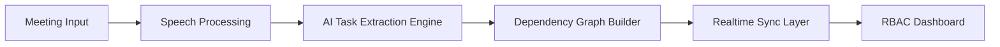
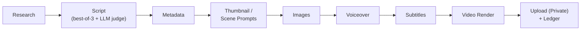
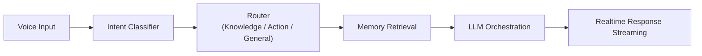
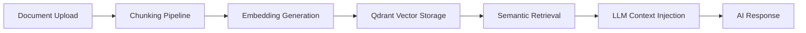

<div align="center">


### Full-Stack Engineer • AI Systems Builder • Production-Focused Developer

Building AI-integrated platforms, realtime systems, automation pipelines, and production-ready applications.

<table>
<tr><td align="center">


</td></tr>
<tr><td align="center">


</td></tr>
</table>

<table>
<tr><td align="center">

[](https://www.linkedin.com/in/nagesh-kore-7566b6254)
[](https://github.com/Nagukore)
[](https://nageshs.vercel.app/)
[](https://www.instagram.com/the.nagesh)

</td></tr>
</table>

**[About](#about-me) · [Recognition](#recognition) · [What I Solve](#what-i-solve) · [Featured Systems](#featured-engineering-systems) · [Projects](#core-engineering-projects) · [Stack](#tech-stack) · [Deployments](#production-deployments) · [Connect](#connect)**

<br/>

**Open to:** `AI Engineering` · `Software Development` · `Product Engineering` · `Research Collaborations`


</div>

---

## About Me

<table>
<tr>
<td width="50%" valign="top">

**Role** — Full-Stack Engineer & AI Systems Builder
**Location** — Bangalore, India
**Education** — B.E. in AI & ML, AMC Engineering College (2026)
**Experience** — Developer Intern @ ThoughtsCrest (Core Banking)

</td>
<td width="50%" valign="top">

**Core Focus**
- AI-integrated full-stack systems
- Realtime infrastructure & orchestration
- Retrieval-Augmented Generation (RAG)
- Autonomous & scheduled automation pipelines
- Production deployment at scale

</td>
</tr>
</table>

> *"If it's not deployed, it's not done."* — API-first architecture, realtime + auth + RBAC as first-class citizens, deploy early because production teaches what staging can't.

**Currently exploring:** Local LLM deployment pipelines · Multi-agent orchestration · Agent memory architectures · Self-improving/feedback-driven pipelines

---

## Recognition

| | |
|---|---|
| 🏆 **Best Paper Award** — IC-AISMART 2025 | Awarded for **FOSYS**, an AI workflow automation & SCRUM intelligence platform |
| 💰 **Funded Project** — KCSTC, Government of Karnataka | **FOSYS** selected for funding by the Karnataka State Council for Science and Technology |
| 📄 **Published Research** — Grenze International Journal | FOSYS research paper — [read on Grenze](https://thegrenze.com/abstract/journal/7548) |
| 📄 **Published Research** — JETIR, Vol. 12, Issue 5 (May 2025) | *Hands-Free Computing: A Gesture-Controlled Virtual AI Mouse* · Paper ID JETIR2505760 |

---

## What I Solve

I build systems where the AI layer has to survive contact with real users and real data — not demos.

**Problem space I keep returning to:**
- **Fragmented workflows** → orchestration systems that route intent (KNOWLEDGE / ACTION / GENERAL) instead of hardcoding every path
- **Stale or unstructured knowledge** → retrieval pipelines (RAG) that make enterprise/document data queryable in plain language
- **Manual, repetitive coordination** → automation that extracts structure from unstructured input (meetings → tasks → dependency graphs)
- **Production gaps between prototype and deployment** → I ship end-to-end: auth, RBAC, realtime sync, hosting — not just the model call

**How I approach it:**
1. Start from the operational bottleneck, not the tech
2. Design API-first so the frontend/backend can evolve independently
3. Treat realtime + auth + RBAC as first-class, not afterthoughts
4. Deploy early — debugging in production teaches things staging can't

---

## Portfolio

> Single-page portfolio with a built-in AI chatbot (NagiBot), glassmorphism animations, dynamic project modals, and a dark-mode aesthetic — React + TypeScript + Vite.

**Live:** [nageshs.vercel.app](https://nageshs.vercel.app/) · **Repo:** [Nagesh-portfolio](https://github.com/Nagukore/Nagesh-portfolio)

`React 18` `TypeScript` `Vite` `Custom CSS Animations` `Glassmorphism`

---

## Featured Engineering Systems

<details>
<summary><strong>⭐ FOSYS — AI Workflow Automation & SCRUM Intelligence Platform 🏆 Best Paper Winner, IC-AISMART 2025 · 💰 Funded by KCSTC (Govt. of Karnataka)</strong></summary>

Production-oriented AI orchestration platform automating SCRUM workflows, meeting intelligence, and task coordination across teams. Selected for funding by the **Karnataka State Council for Science and Technology (KCSTC)**, and published in the **Grenze International Journal** — [read the paper](https://thegrenze.com/abstract/journal/7548).

**Core Capabilities**
- AI-powered meeting transcription and task extraction
- Dependency graph generation for task orchestration
- Role-Based Access Control (RBAC)
- Realtime synchronization via Supabase Realtime
- Intelligent PR workflow automation
- API-first modular backend architecture

**Architecture**


**Stack:** `React` `FastAPI` `Supabase` `Prisma` `PostgreSQL` `Realtime APIs`

</details>

<details>
<summary><strong>⭐ SS Clinic — AI-Integrated Healthcare Website (First Production Client Delivery)</strong></summary>

My first end-to-end full-stack production deployment — delivered to a real healthcare client. Patient-facing platform for SS Clinic, Kudlu.

**Features**
- AI chatbot integration for patient navigation
- Doctor availability & appointment booking workflows
- Progressive Web App with offline mode
- API-driven appointment scheduling

**Why it matters:** this project set the bar for what "production" means to me — real auth, real routing, real users, debugging in prod instead of dev. Every system since has built on it.

**Stack:** `React` `Firebase` `PWA` `AI Chatbot`

**Live:** [ssclinickudlu.com](https://www.ssclinickudlu.com)

</details>

<details>
<summary><strong>⭐ AI YouTube Automation System — Self-Improving Content Pipeline (LangGraph)</strong></summary>

A production-grade system that runs a YouTube Shorts channel end to end — discovers topics, writes and quality-gates scripts, generates images/voiceover/subtitles/video, uploads, and **learns from real engagement data** to improve the next run. Human-in-the-loop by design: every upload defaults to private until a human approves it.

**Pipeline**


**What makes it interesting**
- **Best-of-N script generation with an LLM judge** — 3 candidate drafts at varied temperature, ranked against an engagement rubric (hook, specificity, payoff, quotable close); only the winner renders
- **Closed-loop feedback** — weekly job pulls real view/like/comment stats via YouTube Data API, scores content, and reweights future topic selection — no re-training, just measured arithmetic steering the next run
- **Workflow, not agent, by design** — built on LangGraph but as a fixed, deterministic pipeline (not autonomous tool-picking), so a 6am unattended run stays predictable, resumable, and cost-bounded
- **Runs on $0** — every stage has a free/local default (OpenRouter free-tier LLMs, Pollinations.ai images, Edge TTS voiceover, MoviePy/FFmpeg rendering); dual-mode architecture runs as zero-infra GitHub Actions or as a full FastAPI + Celery + PostgreSQL + React dashboard

**Stack:** `LangGraph` `FastAPI` `Celery` `PostgreSQL` `Redis` `React` `TypeScript` `GitHub Actions` `OpenRouter` `YouTube Data API v3`

</details>

---

## Core Engineering Projects

<details>
<summary><strong>i. VoxFlow — Voice-First AI Assistant</strong></summary>

Multi-stage AI assistant with intelligent intent routing and long-term memory architecture.

**Key Features**
- KNOWLEDGE / ACTION / GENERAL intent routing
- Long-term memory using Qdrant vector database
- SSE-based realtime reminder system
- AI-powered email intelligence
- Voice interaction via Vapi

**Pipeline**


**Stack:** `Node.js` `FastAPI` `Qdrant` `Gemini` `SSE` `Vapi`
**Repo:** [voxflow-ai](https://github.com/Nagukore/voxflow-ai)

</details>

<details>
<summary><strong>ii. Enterprise RAG System — Retrieval-Augmented Knowledge Platform</strong></summary>

Production-oriented semantic retrieval system for structured and unstructured enterprise knowledge bases.

**Retrieval Architecture**


**Stack:** `Python` `FastAPI` `Qdrant` `Gemini Embeddings` `NLP`
**Repo:** [enterprise-rag-system](https://github.com/Nagukore/enterprise-rag-system)

</details>

<details>
<summary><strong>iii. Clinichealthtree — Production Healthcare Infrastructure</strong></summary>

End-to-end clinic management platform: appointment scheduling, JWT auth, role-based dashboards (admin/doctor/patient), realtime updates via Firebase.

**Stack:** `React` `Firebase` `PostgreSQL` `JWT Authentication`
**Live:** [cliniquehealthtree.com](https://www.cliniquehealthtree.com)

</details>

<details>
<summary><strong>iv. Siddeshwara Global Services — Business Platform + E-Commerce</strong></summary>

Multi-page production platform for a Bangalore-based cleaning products supplier, with a full e-commerce storefront: catalog, browsing, ordering, and Google Maps location integration.

**Stack:** `React` `TypeScript` `TailwindCSS` `Firebase` `React Router` `Google Maps API`
**Live:** [siddeshwaraglobalservices.com](https://www.siddeshwaraglobalservices.com)

</details>

<details>
<summary><strong>v. Virtual AI Mouse — Gesture-Controlled Contactless Mouse (Published Research)</strong></summary>

Real-time gesture-controlled virtual mouse using computer vision and hand tracking — no hardware beyond a webcam.

> 📄 **Published:** *Hands-Free Computing: A Gesture-Controlled Virtual AI Mouse* — JETIR, Vol. 12, Issue 5, May 2025 (Paper ID: JETIR2505760)

**Stack:** `Python` `OpenCV` `MediaPipe` `PyAutoGUI`
**Repo:** [VIRTUAL-AI-MOUSE](https://github.com/Nagukore/VIRTUAL-AI-MOUSE)

</details>

<details>
<summary><strong>vi. Advanced Book Scraper CLI — Multithreaded Web Scraping Tool</strong></summary>

High-performance concurrent CLI scraper with retry strategies, filtering, and analytics export.

**Features:** concurrent processing via `ThreadPoolExecutor`, exponential backoff, CSV analytics export

**Stack:** `Python` `BeautifulSoup4` `requests` `ThreadPoolExecutor`
**Repo:** [advanced-book-scraper](https://github.com/Nagukore/advanced-book-scraper)

</details>

<details>
<summary><strong>vii. Hunt the Wumpus — Browser Game (Built in Under 4 Minutes, One Prompt)</strong></summary>

A rapid AI-prototyping experiment: a complete cave exploration game generated from a single, precisely-scoped prompt — no iteration loop, deployed the same session. A small proof of concept that clear problem framing multiplies AI leverage.

**Stack:** `Vanilla JavaScript` `HTML5` `CSS3`
**Live:** [wumpusgames.netlify.app](https://wumpusgames.netlify.app/)

</details>

---

## Tech Stack

**Languages**


**Frontend**


React ecosystem & multi-page architecture · Responsive UI systems · Progressive Web Apps (offline mode) · State management · E-commerce UI/workflow design

**Backend & APIs**


REST API design & JWT auth · Role-Based Access Control (RBAC) · Realtime infrastructure (SSE, Supabase Realtime) · Event-driven workflows

**AI / Machine Learning**


Retrieval-Augmented Generation · AI orchestration & intent routing · LLM-as-judge evaluation patterns · Semantic search & vector embeddings · NLP workflows · Computer vision (MediaPipe, OpenCV) · Multi-agent orchestration (exploring)

**Databases & Vector Storage**


**Cloud, DevOps & Tooling**


**Automation & Integration**


---

## Production Deployments

| Platform | Type | Live Link | Status |
|---|---|---|---|
| Personal Portfolio | Developer Portfolio + NagiBot | [nageshs.vercel.app](https://nageshs.vercel.app/) | ✅ Production |
| SS Clinic | AI Healthcare Website (Client) | [ssclinickudlu.com](https://www.ssclinickudlu.com) | ✅ Production |
| Clinichealthtree | Full-Stack Healthcare Platform | [cliniquehealthtree.com](https://www.cliniquehealthtree.com) | ✅ Production |
| Siddeshwara Global Services | Business Platform + E-Commerce | [siddeshwaraglobalservices.com](https://www.siddeshwaraglobalservices.com) | ✅ Production |
| Hunt the Wumpus | Browser Game (built in 4 min, 1 prompt) | [wumpusgames.netlify.app](https://wumpusgames.netlify.app/) | ✅ Live |
| AI YouTube Automation System | Self-improving content pipeline (LangGraph) | GitHub Actions — daily | ✅ Running |

---

## Engineering Philosophy

```text
▸ Design systems that solve real operational problems
▸ Build modular architectures that scale cleanly
▸ Use AI as a force multiplier, not a gimmick
▸ Prioritize deployment, usability, and reliability
▸ If it's not shipped, it doesn't count
```

---

## GitHub Analytics

<div align="center">


<br/>


<br/><br/>


---

## Connect

<div align="center">

<table>
<tr><td align="center">

[](https://www.linkedin.com/in/nagesh-kore-7566b6254)
[](https://github.com/Nagukore)
[](https://nageshs.vercel.app/)
[](https://www.instagram.com/the.nagesh)

</td></tr>
<tr><td align="center">

[](mailto:nagesh.amcec@gmail.com)

</td></tr>
</table>

**Open to:** open-source collaboration · AI engineering projects · freelance development · startup engineering opportunities

⭐ If something here helps or inspires you, consider starring the repositories.


</div>
