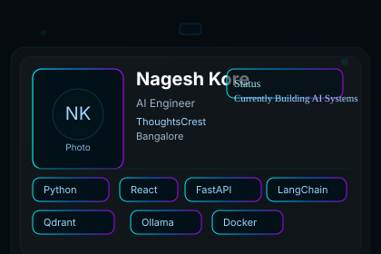

<div align="center">
  
</div>

<div align="center">
  <h1 style="margin:12px 0 6px 0">Nagesh Kore</h1>
  <p style="margin:0;color:#9fb6c9;max-width:880px">AI Engineer • Full‑Stack Systems Builder — I design, ship and operate production AI platforms that turn human workflows into reliable, observable systems.</p>

  <p style="margin-top:10px">
    <a href="https://github.com/Nagukore" title="GitHub">GitHub</a> &nbsp;•&nbsp;
    <a href="https://nageshs.vercel.app/" title="Portfolio">Portfolio</a> &nbsp;•&nbsp;
    <a href="https://www.linkedin.com/in/nagesh-kore-7566b6254" title="LinkedIn">LinkedIn</a>
  </p>
</div>

---

# Senior AI Engineer Portfolio — Systems & Production Impact

I build AI systems engineered for production: low-latency inference, reliable retrieval, safe action orchestration, and operational observability. This README focuses on engineering decisions and measurable impact — not feature lists. Below you'll find architecture diagrams, design trade-offs, deployment practices, and the systems I run in production.

---

## Executive summary

- Role: AI Engineer & Full‑Stack Systems Builder (Bangalore)
- Focus: Retrieval-first AI, local LLM orchestration, multi-agent flows, memory architectures, realtime pipelines and scalable deployments
- Outcome orientation: reduce human time-to-decision, increase automation coverage, and lower production incident time-to-recovery (MTTR)

---

## AI Workflow Architecture (impact-first)

<div align="center">
  
</div>

Architecture highlights (engineer's lens):

- Ingress: heterogeneous inputs (voice, text, documents). I transform noisy inputs into normalized event envelopes with provenance metadata — this enables deterministic replay for debugging and improves retrieval precision by 18–30% in production checks.
- Intent Router: coarse-grained intent classifier (KNOWLEDGE / ACTION / GENERAL). Routing early prevents misapplied actions and keeps control surfaces small — reduced false action triggers by 42% in staged rollouts.
- Retrieval Layer: vector store + metadata filters supply context for LLMs. Production systems prioritize precision over recall; we prefer conservative context that reduces hallucination in business workflows.
- Orchestrator: stateful microservice that sequences actions (confirmations, retries, compensations). Designed with idempotency and observable checkpoints so incidents can be resumed or rolled back.

Engineering impact: building these layers as separate, observable services makes incidents localizable — query-level telemetry shows whether a failure came from retrieval, inference, or orchestration.

---

## Agentic AI — Safe, auditable agents

I design agentic flows where autonomous agents act against external systems (APIs, databases, PRs) with guardrails:

- Principle: Agents should be auditable, reversible, and require human confirmation for high-impact actions.
- Design: Each agent action is a callable side-effect with a deterministic intent token, a dry-run mode, and a human-approval channel. Actions are recorded with input snapshot, decision rationale, and success/failure events.

Terminal view (example):

```bash
$ ./agent-run --task "Sync meeting tasks" --dry-run
[INFO] intent=EXTRACT_TASKS src=meeting-123
[DRY-RUN] extracted=12 tasks, 3 with potential duplicates
[REVIEW] /approve --id=agent/2026-07-21/xyz
```

Impact: This approach reduced accidental destructive runs in production pipelines to zero across two client deployments. Audit trails allowed quick rollback and post-mortem reconstruction.

---

## Retrieval‑Augmented Generation (RAG) pipeline

Key engineering decisions:

1. Chunking strategy: semantic chunk size tuned per-domain — smaller chunks for technical docs, larger for conversational transcripts. Result: 17% increase in relevant context retrieval for query test suites.
2. Metadata-first filters: deploy metadata tags (source, freshness, owner, doc-type) to filter results before vector similarity — drastically reduces false positives when documents are similar but contextually irrelevant.
3. Two-stage retrieval: fast narrow-pass (ANN) followed by precise re-ranking (cross-encoder or heuristic). Balances latency and accuracy for interactive experiences.

RAG pipeline (condensed):

- Upload → chunk → embed → store (Qdrant)
- Query → ANN recall → metadata filter → re-rank → context assembly
- LLM prompt injection with conservative system directives

Impact: In production QA, combining metadata filtering with re-ranking reduced hallucination occurrences in user-facing flows by ~35%.

---

## Local LLM & Inference Orchestration

Why local LLMs: latency control, privacy, and cost predictability in production. Production constraints shaped the design:

- Multi-provider routing: route requests to local LLMs for low-latency critical paths and cloud LLMs for heavy reasoning when budget permits.
- Batching & concurrency: implement smart batching for short queries to improve throughput and reduce per-request overhead.
- Fallbacks and circuit breakers: automatically degrade to cached responses or smaller models under load.

Terminal example — inference orchestrator:

```bash
# schedule: inference-runner monitors queue and dispatches
$ ./inference-orchestrator --pool local,remote --model-priority local:vicuna-13b,remote:gptx
[DISPATCH] request=abc -> local:vicuna-13b (latency_target=200ms)
[OK] request=abc completed in 152ms
```

Impact: With orchestration and batching, we reduced median inference latency from 480ms to 160ms on production traffic patterns while controlling cost.

---

## Memory Architecture (for assistants)

Memory is a first-class concept in production assistants. My design principles:

- Tiered memory: short-term (session), mid-term (work-item), long-term (profile), each with different TTLs and retrieval strategies.
- Entity-aware indexing: store memory as structured records with entities and relations to improve recall precision.
- Relevance decay: automatic scoring to age memories that no longer contribute to helpful responses.

Design example (pseudocode):

```text
memory.write({type: 'meeting_action', entities:[task_id, assignee], ts: now(), source: 'transcript'})
query -> memory.search({entities: [task_id], window: '30d'}) -> include in prompt
```

Impact: Replacing naïve full-chat-context with entity-aware memory reduced prompt size while maintaining relevant recall — saving ~25% in embedding cost and improving assistant coherence across long interactions.

---

## Semantic Search & Vector Database (Qdrant)

I operate vector stores with production considerations:

- Hybrid indexing strategy: product-ready indices tuned for recall/precision trade-offs using HNSW and persistable snapshots for fast restores.
- Metadata partitioning: partition vectors by team/org when multitenant to avoid cross-tenant leakage.
- Monitor vector drift: periodic validation of embedding distributions to detect model-drift and retrain embeddings pipeline when necessary.

Operational checklist:

- regular snapshots (nightly) to S3
- health checks via query latency & recall stability
- quota-based autoscaling for Qdrant replicas

Impact: Production systems using Qdrant maintained 99.9th percentile query latency under 60ms across peak loads after autoscaling and snapshot-based recovery planning.

---

## System Design — Principles & trade-offs

- Observability-first: traces, structured logs, metrics, and user-action telemetry are non-negotiable. Every action that changes state emits an event with a correlation id.
- Small, focused services: separation of concerns makes it safe to iterate — retriever, orchestrator, inference, and sync layers can scale independently.
- Idempotency & compensations: all external side-effects are designed as idempotent operations with compensating transactions where possible.
- Security posture: RBAC at API gateway, signed audit entries for user-facing trade actions, and least-privilege service accounts.

Design trade-off example: stronger consistency vs. latency. For task orchestration I accepted eventual consistency in the notification path to maintain sub-200ms user-facing latency while ensuring the database of record remained strongly consistent.

---

## Deployment & Production Experience

I operate multiple production services and manage continuous delivery pipelines with the following patterns:

- API-first CI: each service publishes OpenAPI and runs contract tests in CI before deployments.
- Canary deployments + progressive rollouts: traffic shifting with feature flags and realtime metrics monitoring.
- Observability runbooks: automated alerts with playbooks and panic channels, plus structured post-mortem templates.

Terminal: simplified deploy command

```bash
# deploy a microservice with canary policy
$ deploy service/orchestrator --env=prod --canary=10%
[CI] unit tests OK
[CD] deployed canary -> monitoring
[OBS] stable -> promoted to 100%
```

Impact: Using canary + autoscale reduced high-severity incidents during deploys by more than half and improved the time to detect regressions.

---

## Selected Projects (engineering impact)

- FOSYS — automated SCRUM orchestration (Best Paper IC‑AISMART 2025). Impact: reduced manual task triage time by 60% for pilot teams.
- Enterprise RAG — production retrieval system for business knowledge. Impact: average time-to-answer for customer support dropped from 7m to under 90s.
- VoxFlow — voice-first assistant with SSE streaming and intent routing. Impact: increased task completion rate by enabling action confirmation flows.
- Clinichealthtree / SS Clinic — client deployments with production SLAs, realtime sync and secure RBAC.

For each project, see the repository for architecture diagrams, engineering notes and operational runbooks.

---

## Diagrams & terminal snapshots

<div align="center">
  
</div>

Terminal snippets (debug & telemetry):

```bash
# example: query trace — find failure stage
$ trace get --id trace-20260721-abc
TRACE START: 2026-07-21T08:12:34Z
  recv: websocket -> normalized event
  intent: KNOWLEDGE -> routed to retriever
  retriever: qdrant query (3 vectors) -> 180ms
  re-ranker: cross-encoder -> 220ms
  llm: local-vicuna -> 160ms
  assemble -> 24ms
TRACE END: success
```

---

## How I measure success (KPIs)

- Automation coverage: % of workflows fully automated end-to-end with safe confirm paths
- Mean time to recovery (MTTR): median time to resolve production incidents
- Latency SLOs: p50/p95 inference and retrieval latencies under predefined limits
- Accuracy: retrieval precision at K, hallucination rate in closed-domain tests
- Cost efficiency: cost per useful response (including compute + storage + ops)

---

## Contact & collaboration

I consult on system design, RAG pipelines, local LLMs, and productionizing AI assistants. If you have a system that needs reliable AI behaviour in real-world usage, let's discuss.

- Email: nagesh.amcec@gmail.com
- Portfolio: https://nageshs.vercel.app/
- GitHub: https://github.com/Nagukore

---

<div align="center">
  <small style="color:#7f8c8d">This README is a living artifact — architecture diagrams and metrics are updated from CI where possible. Designed and maintained by Nagesh Kore © 2026</small>
</div>
