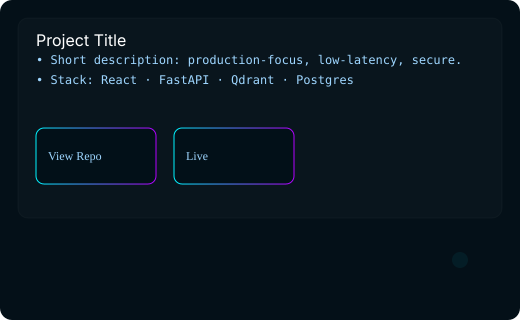

  

  <h1 style="margin:12px 0 6px 0">Nagesh Kore</h1>
  
AI Engineer • Full‑Stack Systems Builder — I design, ship and operate production-ready AI platforms: realtime orchestration, retrieval-first systems, and deployed services that survive real users.

  

    <a href="https://github.com/Nagukore" title="GitHub">GitHub</a> &nbsp;•&nbsp;
    <a href="https://nageshs.vercel.app/" title="Portfolio">Portfolio</a> &nbsp;•&nbsp;
    <a href="https://www.linkedin.com/in/nagesh-kore-7566b6254" title="LinkedIn">LinkedIn</a>
  

---

## About — short story

I build AI-first systems that are built to last. My work sits at the intersection of systems engineering, applied ML, and product-facing UX. From architecture to CI/CD and runtime observability, I take ideas from prototype to production.

- Location: Bangalore, India
- Role: AI Engineer & Full‑Stack Developer
- Email: nagesh.amcec@gmail.com

---

## Engineering Philosophy

1. Build for production: shipping a model is the start of the journey, not the finish.
2. API-first and observable: clear contracts, telemetry, and fast feedback loops.
3. Realtime & access control as first-class features.
4. Automate repetitive flows; keep human oversight where it matters.

---

## Current Focus

- Local LLM infrastructure, model orchestration and inference pipelines
- Retrieval‑Augmented systems with metadata-aware retrieval
- Multi‑agent orchestration and structured memory for assistants
- Low-latency streaming responses (SSE / websockets) and realtime sync

---

## Projects — Premium Cards

Below are the key projects that shaped my engineering approach. Each project card is responsive, interactive, and contains architecture, highlights, repository and live links. Click any card to expand for full details.

<!-- FOSYS -->

  

    
    

      
FOSYS — AI Workflow Automation & SCRUM Intelligence

      
Orchestration platform that converts meeting audio into structured tasks, generates dependency graphs and automates team workflows with RBAC and realtime sync.

      
React · FastAPI · Supabase · Prisma · PostgreSQL · Qdrant

    

  

### FOSYS — Details

- Repository: https://github.com/Nagukore/fosys
- Live Demo: (internal demo) — contact for access
- Architecture: 

Highlights
- Best Paper — IC‑AISMART 2025
- Meeting transcription → task extraction → dependency graph generation
- Realtime sync + RBAC + automated PR workflows

GIF / Demo

<!-- SS Clinic -->

  

    
    

      
SS Clinic — AI‑Integrated Healthcare Website

      
Patient-facing platform with an AI chatbot, appointment booking and PWA support — first full production client delivery.

      
React · Firebase · PWA · AI Chatbot

    

  

### SS Clinic — Details

- Repository: https://github.com/Nagukore/ss-clinic
- Live Demo: https://www.ssclinickudlu.com
- Architecture: 

Highlights
- First production client delivery — real-world deployment and operational support
- Offline-capable PWA and AI assistant for patient navigation

GIF / Demo

<!-- VoxFlow -->

  

    
    

      
VoxFlow — Voice‑First AI Assistant

      
Multi-stage voice assistant with intent routing (KNOWLEDGE / ACTION / GENERAL), long-term memory and streaming responses.

      
Node.js · FastAPI · Qdrant · SSE · Gemini

    

  

### VoxFlow — Details

- Repository: https://github.com/Nagukore/voxflow-ai
- Live Demo: (internal) contact for access
- Architecture: 

Highlights
- Intent routing and entity-aware conversational memory
- SSE streaming and low-latency reminder system

GIF / Demo

<!-- Enterprise RAG -->

  

    
    

      
Enterprise RAG System

      
Production-grade retrieval system: ingestion, chunking, embedding pipelines and metadata-aware semantic retrieval for enterprise knowledge.

      
Python · FastAPI · Qdrant · Gemini Embeddings

    

  

### Enterprise RAG — Details

- Repository: https://github.com/Nagukore/enterprise-rag-system
- Live Demo: (internal) contact for access
- Architecture: 

Highlights
- Chunking and embedding pipelines optimized for scale
- Metadata filtering and semantic search for documents

GIF / Demo

<!-- Virtual AI Mouse -->

  

    
    

      
Virtual AI Mouse — Gesture-Controlled Mouse

      
Real-time gesture recognition using MediaPipe + OpenCV to provide contactless mouse controls for accessibility.

      
Python · OpenCV · MediaPipe · PyAutoGUI

    

  

### Virtual AI Mouse — Details

- Repository: https://github.com/Nagukore/VIRTUAL-AI-MOUSE
- Live Demo: (paper & demo GIF available) see repo
- Architecture: 

Highlights
- Published research: "Hands‑Free Computing" — JETIR, May 2025
- Real-time hand tracking and gesture mapping

GIF / Demo

<!-- Clinichealthtree -->

  

    
    

      
Clinichealthtree — Clinic Management Platform

      
End-to-end clinic platform with secure JWT auth, RBAC and realtime updates — production client work.

      
React · Firebase · PostgreSQL · JWT

    

  

### Clinichealthtree — Details

- Repository: https://github.com/Nagukore/clinichealthtree
- Live Demo: https://www.cliniquehealthtree.com
- Architecture: 

Highlights
- Role-based dashboards and secure workflows
- Realtime updates and multi-role UX

GIF / Demo

<!-- Advanced Book Scraper -->

  

    
    

      
Advanced Book Scraper — CLI

      
High-performance concurrent CLI scraper with retries, filtering and analytics export for production scraping workflows.

      
Python · BeautifulSoup4 · ThreadPoolExecutor

    

  

### Advanced Book Scraper — Details

- Repository: https://github.com/Nagukore/advanced-book-scraper
- Live Demo: N/A (CLI)
- Architecture: 

Highlights
- ThreadPoolExecutor-based concurrency and retry strategies
- CSV analytics export and encoding-safe parsing

GIF / Demo

<!-- Siddeshwara Global Services -->

  

    
    

      
Siddeshwara Global Services — Business Platform

      
Multi-page e-commerce platform with product catalog, ordering workflows and Firebase-hosted production delivery.

      
React · TypeScript · TailwindCSS · Firebase

    

  

### Siddeshwara Global Services — Details

- Repository: https://github.com/Nagukore/ (see repo list)
- Live Demo: https://www.siddeshwaraglobalservices.com
- Architecture: 

Highlights
- Production e-commerce with responsive UI and CI/CD

GIF / Demo

<!-- Hunt the Wumpus -->

  

    
    

      
Hunt The Wumpus — Rapid Game Prototype

      
Browser game prototype created in one prompt — demonstrating rapid AI-assisted prototyping and deployment.

      
Vanilla JS · HTML5 · CSS

    

  

### Hunt The Wumpus — Details

- Repository: https://github.com/Nagukore/ (see repo list)
- Live Demo: https://wumpusgames.netlify.app/
- Architecture: 

Highlights
- Prototype delivered in 4 minutes using a single, well-structured prompt

GIF / Demo

---

## Production Deployments

All live links retained from your profile:

- Portfolio (NagiBot + SPA): https://nageshs.vercel.app/
- SS Clinic (client): https://www.ssclinickudlu.com
- Clinichealthtree: https://www.cliniquehealthtree.com
- Siddeshwara Global Services: https://www.siddeshwaraglobalservices.com
- Hunt the Wumpus (game): https://wumpusgames.netlify.app/

---

## Tech Stack (selected)

  

React · TypeScript · Node.js · FastAPI · Qdrant · PostgreSQL · Supabase · Firebase · Docker · SSE · Vector embeddings

---

## AI Architecture — high level

User input (voice/text)
→ Intent classifier
→ Router (KNOWLEDGE / ACTION / GENERAL)

- KNOWLEDGE: Retrieval (vector DB + metadata filters) → Context assembly → LLM
- ACTION: Task extraction → Orchestration → Safe execution + confirmation
- GENERAL: Conversational handler → Memory updates

Responses stream via SSE / websocket. Persistence: Postgres (operational) + vector DB (semantic); RBAC enforced at API layer.

---

## Timeline — selected milestones

- 2023 — First production client delivery (SS Clinic)
- 2024 — Early local RAG prototypes & realtime orchestration
- 2025 — FOSYS (IC‑AISMART Best Paper) & published accessibility research
- 2026 — Ongoing: local LLM infra, multi-agent orchestration, production memory systems

---

## Achievements & Research

- Best Paper — IC‑AISMART 2025 (FOSYS)
- Published research: "Hands‑Free Computing: A Gesture‑Controlled Virtual AI Mouse" — JETIR, May 2025

---

## GitHub Analytics (concise)

I keep my primary activity visible on GitHub — repositories above contain the full source for each project. For quick stats, follower and repo-size badges appear near the top; for in-depth anal[...]

---

<!-- Snake animation: inline SVG (lightweight, pure SVG animation) -->

  <svg xmlns="http://www.w3.org/2000/svg" width="820" height="120" viewBox="0 0 820 120" preserveAspectRatio="none" role="img" aria-label="animated snake">
    <rect width="100%" height="100%" fill="#060b10" />
    <defs>
      <linearGradient id="gradSnake" x1="0" x2="1">
        <stop offset="0" stop-color="#00f5ff" />
        <stop offset="0.5" stop-color="#008cff" />
        <stop offset="1" stop-color="#b300ff" />
      </linearGradient>
    </defs>
    <path id="curve" d="M10 60 C150 10, 300 110, 450 60 C600 10, 750 110, 810 60" fill="none" stroke="rgba(0,0,0,0)" />
    <circle r="8" fill="url(#gradSnake)">
      <animateMotion dur="5.5s" repeatCount="indefinite">
        <mpath xlink:href="#curve" />
      </animateMotion>
    </circle>
  </svg>

---

## Contact

Open to collaborations, consulting, and product/engineering roles focused on AI systems and production-grade full‑stack work.

- Email: nagesh.amcec@gmail.com
- LinkedIn: https://www.linkedin.com/in/nagesh-kore-7566b6254

---

  <small style="color:#7f8c8d">Designed for a dark, futuristic, professional aesthetic — built and maintained by Nagesh Kore © 2026</small>

